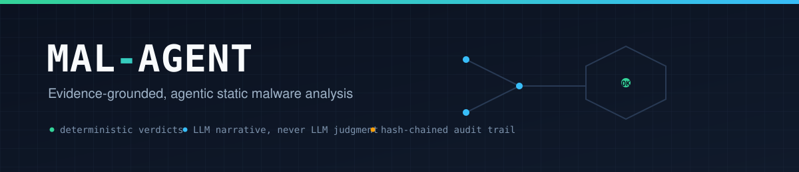
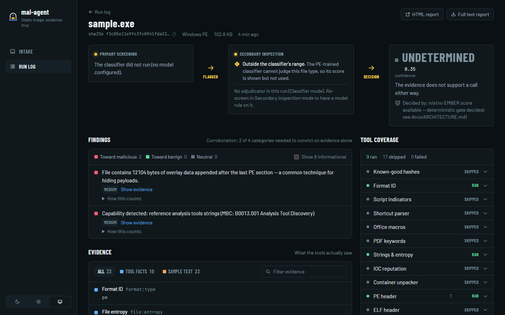
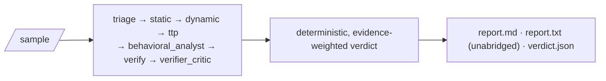

<p align="center">
  
</p>

<p align="center">
  <a href="https://github.com/AnimeshShaw/mal-agent/actions/workflows/ci.yml"></a>
  <a href="LICENSE"></a>
  
  
  <a href="https://animeshshaw.github.io/mal-agent/"></a>
  <a href="https://huggingface.co/datasets/AnimeshShaw/mal-agent-llm-adjudication-eval"></a>
</p>

<p align="center">
  
  
  
  
</p>

<p align="center">
  <b>Every verdict traces to tool evidence. Nothing is guessed.</b>
</p>

---

MAL-AGENT is an **evidence-grounded, agentic static malware analysis
pipeline**. It runs a suspicious file through deterministic tools (PE
parsing, `capa` capability detection, headless Ghidra decompilation,
Authenticode checks) and optional LLM reasoning agents, then produces a
`malicious` / `suspicious` / `benign` / `undetermined` verdict that a
human can audit end-to-end — every claim links to real tool evidence, and
the numeric score behind the verdict is computed **deterministically**,
never by an LLM's opinion.

<p align="center">
  
</p>
<p align="center"><sub>The local web UI (<code>mal-agent web</code>) on a real run — every tool shown as ran/skipped, every finding tagged, the verdict always explained, never guessed.</sub></p>

## Why MAL-AGENT

- 🔒 **Evidence-grounded by construction.** A `Finding` only counts
  toward the verdict if it cites evidence that a deterministic verifier
  confirms actually exists. Ungrounded claims are shown (transparency),
  never scored.
- 🧠 **LLMs narrate, they never judge.** A `behavioral_analyst` agent
  writes a readable narrative from the evidence, and a `verifier_critic`
  agent fact-checks that narrative against the raw evidence — but the
  narrative's severity is hardcoded to zero weight. A regression test
  (`tests/test_llm_agents_never_score.py`) feeds it a deliberately
  alarming fake "this is definitely ransomware!!!" response and asserts
  the verdict doesn't move. This is enforced, not just intended.
- 🔍 **Retrieval-grounded narrative, not bare technique IDs.** capa's real
  ATT&CK/MBC matches already carry human-readable tactic/objective names,
  not just codes — `behavioral_analyst` retrieves the real MITRE tactic
  description for whichever tactics a sample actually touches and grounds
  its cross-technique narrative in that, instead of synthesizing across
  opaque IDs with no shared context. Retrieval only shapes the narrative;
  it never touches the deterministic score (see `docs/ARCHITECTURE.md` §4a).
- 📋 **Nothing is a black box.** Every run produces an unabridged `.txt`
  report — every finding, every evidence excerpt, the full tamper-evident
  audit log, every model call — alongside the human-readable summary and
  a machine-readable `verdict.json`.
- 🛡️ **Fails closed, not silently.** No API keys, no Ghidra, no network?
  The pipeline still runs and reports exactly what it could and couldn't
  determine — it never guesses `benign` because a stage was unavailable.
- ⚡ **Real bugs, found and fixed live.** This isn't paper-only design —
  see [Verified live](#verified-live-real-bugs-found-and-fixed) below for
  a genuine false-positive-on-`notepad.exe` bug found and fixed by
  running the full real toolchain, not mocks.

## Quick start

```bash
pip install -e .
mal-agent path/to/sample --source dataset --out ./out
```

Runs the deterministic spine (feature extraction, IOC/PE-import
extraction, known-good hash allowlist, Authenticode check, `capa`-if-
present), the evidence-grounding verifier, and renders all three reports.
No external services required for this path — model and dynamic-analysis
stages report themselves as `skipped`/`undetermined` honestly rather than
silently degrading.

```bash
mal-agent doctor
```

Checks your toolchain (pefile, capa+rules+sigs, Ghidra+pyghidra, Java,
Ollama+model, cloud API keys, database, known-good allowlist) and reports
`PASS`/`WARN`/`FAIL` per check — `FAIL` means something was explicitly
configured but is broken, not merely absent.

**One-command setup** (creates a venv, installs everything, scaffolds
`.env`): `scripts/install.ps1` (Windows) or `scripts/install.sh`
(Linux/macOS). A full-automation variant that also installs
Ghidra/JDK/Ollama/Postgres/EMBER model: `scripts/install-full.ps1`/`.sh`.
Full detail on both paths, plus a troubleshooting section built from real
bugs hit during this project's own setup: **[docs/SETUP.md](docs/SETUP.md)**.
Every other script in `scripts/` (dataset construction, reproduction,
one-off research runs) is catalogued in
**[scripts/README.md](scripts/README.md)**.

### Web UI

An interactive, local alternative to the CLI's static report files —
same verdict, same per-tool honesty (every tool shown as ran/skipped/
error with a real reason, every finding tagged supports-malicious/
supports-benign/neutral), live in the browser instead of a text dump.

```bash
pip install -e ".[web]"
cd web/frontend && npm install && npm run build && cd ../..
mal-agent web
```

Serves the API and the built frontend from one process on one port
(default `http://127.0.0.1:8765`) — `--host`/`--port` to change either.
Persists runs to a local SQLite file (`malagent_web.db`) by default, not
Postgres, so no server process is required for a single-operator local
tool; set `DATABASE_URL` yourself to opt into Postgres instead. Not yet
built: `npm run dev` is the frontend's own hot-reload dev server (proxies
`/api` to the backend) if you're modifying `web/frontend/src/`.

### CLI reference

Two commands cover everyday use:

```bash
mal-agent analyze path/to/sample [--fusion-mode simple|cgef] [--out ./out]
mal-agent web [--host 127.0.0.1] [--port 8765]
```

`mal-agent path/to/sample` (no `analyze` keyword) still works — the
positional form above is the original, still-supported invocation.
The measurement/ablation tools that produced this project's real
calibration and ablation numbers (`evaluate`, `make-manifest`,
`suggest-verdict`, `ablate-critic`, `family-attribution`, `ablate-llm`)
are grouped under `research`, needed for reproducing those numbers, not
everyday analysis:

```bash
mal-agent research evaluate dataset/manifest.csv --fusion-mode cgef
mal-agent research ablate-llm dataset/manifest.csv
```

Old flat forms (`mal-agent evaluate ...` without the `research` prefix)
still work too, as undocumented-but-functional aliases. Full reference
for every subcommand and flag: **[docs/CLI.md](docs/CLI.md)**.

## How it works



Full architecture — the evidence-grounding model, why an LLM narrative
can never move the verdict score, the tool inventory, model routing and
egress policy, the audit trail — is documented with diagrams in
**[docs/ARCHITECTURE.md](docs/ARCHITECTURE.md)**. Read that if you're
evaluating or contributing to this project.

## Results

Main experiment, 681 held-out test samples, three adjudicator models
(two local via Ollama, one frontier via API) under the same bounded
routing policy — only classifier-uncertain cases are escalated to an LLM,
and every LLM verdict must cite real tool evidence or it's overridden.
Full numbers (per-format breakdowns, adversarial robustness, calibration,
McNemar significance tests) are in
**[docs/RESEARCH.md](docs/RESEARCH.md)**; the complete raw per-sample
output behind every number here is deposited on
[Hugging Face](https://huggingface.co/datasets/AnimeshShaw/mal-agent-llm-adjudication-eval)
and Mendeley Data (DOI pending) — this table is the summary, not the
whole story.

| Arm | Precision | Recall | F1 | FPR | Coverage |
|---|---|---|---|---|---|
| EMBER2024 alone (PE, no LLM) | 0.983 | 0.338 | 0.503 | 1.9% | 32.5% |
| Hybrid[qwen3:8b] (local) | 0.886 | 0.766 | 0.822 | 11.5% | **84.9%** |
| Hybrid[gemma4:12b] (local) | 0.953 | 0.728 | 0.825 | 8.3% | 57.0% |
| Hybrid[Gemini 3.1 Pro] (frontier) | **0.992** | **0.725** | **0.837** | **0.8%** | 74.4% |

Headline findings, stated plainly:

- **Bounding fixes a coverage collapse that hurts every model** — EMBER
  alone commits on only 32.5% of samples; every Hybrid arm roughly
  doubles or triples that while keeping precision above 0.88.
- **The frontier model's own false-positive rate is already low without
  bounding** (LLM-alone[Gemini] FPR = 0.8%, identical to its Hybrid FPR)
  — the "letting an LLM judge everything inflates false positives"
  problem this project's bounding exists to fix is real for 7–12B local
  models (FPR would be 77–89% unbounded) and nearly absent for a frontier
  model. Bounding still buys something for a frontier model (it's what
  gates the other 25.6% of cases down to a 0% override rate), just not
  the same thing it buys for a local one.
- **No single model/metric dominates**: qwen3:8b's Hybrid arm beats
  Gemini's on raw per-sample correctness (McNemar 68 vs. 45, p=0.038) —
  driven by qwen3:8b committing on far more cases (84.9% vs. 74.4%
  coverage), not by being more accurate per case it does commit on.

## Turn on more

Every stage above runs with zero config. Turn on more as you need it —
each one has a one-line enable + a note on whether it's been verified
live, not just coded:

| Add | One-liner |
|---|---|
| ATT&CK/MBC capability detection | `pip install flare-capa` + rules/sigs |
| PE imports, imphash, entropy, Rich header | `pip install pefile` |
| ELF imports + section entropy | `pip install pyelftools` |
| YARA matching (your own rules) | `pip install yara-python`, set `YARA_RULES_PATH` |
| Packer/compiler ID (`die`) | install `diec`, no config |
| VirusTotal hash lookup | `VIRUSTOTAL_API_KEY` + explicit egress opt-in |
| EMBER2024 ML classifier (PE verdicts) | `pip install thrember`, download a `.model` file |
| Ghidra decompilation + call graphs | `pip install -e ".[ghidra]"`, set `GHIDRA_HOME` |
| LLM reasoning agents (local or cloud) | `pip install -e ".[providers]"`, `ollama pull qwen3:8b` |
| Postgres persistence | `docker compose up -d db` |
| IOC reputation (zero-egress) | point `IP_BLOCKLIST_PATH`/`DOMAIN_BLOCKLIST_PATH` at your own lists |

Full detail on every one of these — exact commands, what's been
live-verified vs. not, and the real false-positive bug the known-good
allowlist fixes — is in **[Turn On More](https://animeshshaw.github.io/mal-agent/FEATURES/)**.

## Verified live (real bugs, found and fixed)

Every claim below comes from running the full pipeline against real
tools — real `capa` (+ rules/sigs), real headless Ghidra (via
`pyghidra`), a real local Ollama model, real Postgres — not mocks.

**A real false positive, found and fixed.** The original verdict
heuristic summed every `capa` capability match with equal `medium`
severity, so 35 correctly-detected but entirely mundane capabilities
(read file, create directory, get disk size, ...) on a stock,
unmodified `notepad.exe` scored **`MALICIOUS` at 0.9 confidence**.
Root-caused, fixed two ways grounded in capa's own real rule-namespace
taxonomy (not guesswork), and re-verified live:

1. Severity is now assigned by capa rule *namespace* — only namespaces
   that are inherently attacker-relevant on their own (`anti-analysis`,
   `collection`, `communication`, `exploitation`, `impact`, `load-code`,
   `persistence`, `malware-family`) count as `medium`+.
2. A verdict of `suspicious`/`malicious` now requires corroboration
   across **≥3 distinct** high-signal categories — a couple of matches
   in one or two categories (individually false-positive-prone; e.g.
   anti-debugging checks are also common in legitimate DRM/licensing
   code) isn't enough to convict alone.

**Result: `MALICIOUS 0.9` → `UNDETERMINED 0.35`** — not a false `benign`
either; there genuinely are 2 high-signal-category matches, just not
enough to corroborate a verdict either way. This is a heuristic
improvement grounded in real data, not validated calibration — that
still needs labeled malware/benign datasets.

Also verified live: the known-good allowlist short-circuit (0.88s vs.
several minutes on a matched hash), Authenticode signature extraction
against a real Microsoft-signed binary, and `PostgresRepository`
round-tripping a real run's verdict.

## Testing

```bash
pip install pytest && pytest -q          # core suite
pytest -q web/backend                    # web UI backend
```

663 tests across both suites, TDD throughout — every feature was built
failing-test-first. See [CONTRIBUTING.md](CONTRIBUTING.md) for the
workflow this project expects contributions to follow.

## Roadmap

M0 deterministic spine → M1 local model summaries → M2 headless-Ghidra
decompilation → M3 cloud escalation + egress enforcement → M4 ATT&CK +
YARA + retrieval-grounded narrative → M4.5 LLM reasoning agents
(behavioral narrative + fact-checking critic) → mandatory unabridged
`.txt` reporting → `doctor` + install automation → format-aware triage
for non-PE lures (scripts/LNK/Office/PDF) → a redesigned local web UI —
all shipped and verified live. M5 (dynamic detonation) is stubbed by
design (v1 is static-only). The current research question — whether a
bounded, evidence-gated LLM adjudicator improves on EMBER2024 alone for
the specific cases it's genuinely unsure about — has a full
bundle/routing/adjudication architecture, a 1,504-sample dataset spanning
15+ file formats, and a reproducible experiment harness
(`mal-agent research build-bundles|judge-run|judge-claims|judge-report`);
see [docs/RESEARCH.md](docs/RESEARCH.md) for the design, how to reproduce
it, and the honestly-stated limitations (including a real evaluation-
validity bug this project found and fixed in its own earlier numbers: a
benign-set/known-good-allowlist overlap had made several previously
reported precision/recall/F1 figures artifacts of a hash lookup, not
analysis).

## Documentation

Full index: [docs/README.md](docs/README.md). Highlights:
[docs/ARCHITECTURE.md](docs/ARCHITECTURE.md) (how it works),
[docs/SETUP.md](docs/SETUP.md) (install).

## Citing this work

If you use this software, cite it via [CITATION.cff](CITATION.cff) (GitHub's
"Cite this repository" button reads this file automatically) or the Zenodo
DOI once a release is archived there. If you use the accompanying research
(dataset v2, the evidence-bundle/routing/adjudication architecture, or any
reported evaluation numbers), see [docs/RESEARCH.md](docs/RESEARCH.md) and
[paper/](paper/) for the paper to cite once it's public.

## Contributing

Issues and PRs welcome — see [CONTRIBUTING.md](CONTRIBUTING.md).

## License

[MIT](LICENSE).
