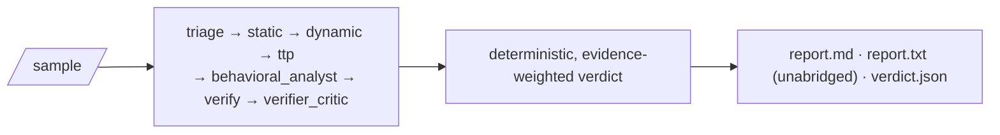

<p align="center">
  
</p>

<p align="center">
  <a href="https://github.com/AnimeshShaw/mal-agent/actions/workflows/ci.yml"></a>
  <a href="LICENSE"></a>
  
  
</p>

<p align="center">
  <b>Every verdict traces to tool evidence. Nothing is guessed.</b>
</p>

---

MAL-AGENT is an **evidence-grounded, agentic static malware analysis
pipeline**. It runs a suspicious file through deterministic tools (PE
parsing, `capa` capability detection, headless Ghidra decompilation,
Authenticode checks) and optional LLM reasoning agents, then produces a
`malicious` / `suspicious` / `benign` / `undetermined` verdict that a
human can audit end-to-end — every claim links to real tool evidence, and
the numeric score behind the verdict is computed **deterministically**,
never by an LLM's opinion.

## Why MAL-AGENT

- 🔒 **Evidence-grounded by construction.** A `Finding` only counts
  toward the verdict if it cites evidence that a deterministic verifier
  confirms actually exists. Ungrounded claims are shown (transparency),
  never scored.
- 🧠 **LLMs narrate, they never judge.** A `behavioral_analyst` agent
  writes a readable narrative from the evidence, and a `verifier_critic`
  agent fact-checks that narrative against the raw evidence — but the
  narrative's severity is hardcoded to zero weight. A regression test
  (`tests/test_llm_agents_never_score.py`) feeds it a deliberately
  alarming fake "this is definitely ransomware!!!" response and asserts
  the verdict doesn't move. This is enforced, not just intended.
- 🔍 **Retrieval-grounded narrative, not bare technique IDs.** capa's real
  ATT&CK/MBC matches already carry human-readable tactic/objective names,
  not just codes — `behavioral_analyst` retrieves the real MITRE tactic
  description for whichever tactics a sample actually touches and grounds
  its cross-technique narrative in that, instead of synthesizing across
  opaque IDs with no shared context. Retrieval only shapes the narrative;
  it never touches the deterministic score (see `docs/ARCHITECTURE.md` §4a).
- 📋 **Nothing is a black box.** Every run produces an unabridged `.txt`
  report — every finding, every evidence excerpt, the full tamper-evident
  audit log, every model call — alongside the human-readable summary and
  a machine-readable `verdict.json`.
- 🛡️ **Fails closed, not silently.** No API keys, no Ghidra, no network?
  The pipeline still runs and reports exactly what it could and couldn't
  determine — it never guesses `benign` because a stage was unavailable.
- ⚡ **Real bugs, found and fixed live.** This isn't paper-only design —
  see [Verified live](#verified-live-real-bugs-found-and-fixed) below for
  a genuine false-positive-on-`notepad.exe` bug found and fixed by
  running the full real toolchain, not mocks.

## Quick start

```bash
pip install -e .
mal-agent path/to/sample --source dataset --out ./out
```

Runs the deterministic spine (feature extraction, IOC/PE-import
extraction, known-good hash allowlist, Authenticode check, `capa`-if-
present), the evidence-grounding verifier, and renders all three reports.
No external services required for this path — model and dynamic-analysis
stages report themselves as `skipped`/`undetermined` honestly rather than
silently degrading.

```bash
mal-agent doctor
```

Checks your toolchain (pefile, capa+rules+sigs, Ghidra+pyghidra, Java,
Ollama+model, cloud API keys, database, known-good allowlist) and reports
`PASS`/`WARN`/`FAIL` per check — `FAIL` means something was explicitly
configured but is broken, not merely absent.

**One-command setup** (creates a venv, installs everything, scaffolds
`.env`): `scripts/install.ps1` (Windows) or `scripts/install.sh`
(Linux/macOS). A full-automation variant that also installs
Ghidra/JDK/Ollama/Postgres: `scripts/install-full.ps1`/`.sh`. Full detail
on both paths, plus a troubleshooting section built from real bugs hit
during this project's own setup: **[docs/SETUP.md](docs/SETUP.md)**.

### Web UI

An interactive, local alternative to the CLI's static report files —
same verdict, same per-tool honesty (every tool shown as ran/skipped/
error with a real reason, every finding tagged supports-malicious/
supports-benign/neutral), live in the browser instead of a text dump.

```bash
pip install -e ".[web]"
cd web/frontend && npm install && npm run build && cd ../..
mal-agent web
```

Serves the API and the built frontend from one process on one port
(default `http://127.0.0.1:8765`) — `--host`/`--port` to change either.
Persists runs to a local SQLite file (`malagent_web.db`) by default, not
Postgres, so no server process is required for a single-operator local
tool; set `DATABASE_URL` yourself to opt into Postgres instead. Not yet
built: `npm run dev` is the frontend's own hot-reload dev server (proxies
`/api` to the backend) if you're modifying `web/frontend/src/`.

### CLI reference

Two commands cover everyday use:

```bash
mal-agent analyze path/to/sample [--fusion-mode simple|cgef] [--out ./out]
mal-agent web [--host 127.0.0.1] [--port 8765]
```

`mal-agent path/to/sample` (no `analyze` keyword) still works — the
positional form above is the original, still-supported invocation.
The measurement/ablation tools that produced this project's real
calibration and ablation numbers (`evaluate`, `make-manifest`,
`suggest-verdict`, `ablate-critic`, `family-attribution`, `ablate-llm`)
are grouped under `research`, needed for reproducing those numbers, not
everyday analysis:

```bash
mal-agent research evaluate dataset/manifest.csv --fusion-mode cgef
mal-agent research ablate-llm dataset/manifest.csv
```

Old flat forms (`mal-agent evaluate ...` without the `research` prefix)
still work too, as undocumented-but-functional aliases.

## How it works



Full architecture — the evidence-grounding model, why an LLM narrative
can never move the verdict score, the tool inventory, model routing and
egress policy, the audit trail — is documented with diagrams in
**[docs/ARCHITECTURE.md](docs/ARCHITECTURE.md)**. Read that if you're
evaluating or contributing to this project.

## Turn on more

- **Known-good hash allowlist** (skips expensive stages on a match): set
  `KNOWN_GOOD_HASHES_PATH` to a hash-per-line file or `hash,name` CSV (an
  NSRL RDS export works directly). Verified live: ~1s instead of several
  minutes on a matched sample, verdict `benign` at high confidence. This
  is more than a performance shortcut — verified live that without it,
  the deterministic corroboration gate itself (§6, no LLM involved) could
  false-positive `malicious` at 0.9 confidence on legitimate Windows admin
  binaries, because their real, intended function genuinely spans
  attacker-relevant capa namespaces (task scheduling *is* MITRE T1053.005;
  remote admin tools legitimately need networking). A validly-signed
  binary now needs one *additional* corroborating category before
  conviction (§6) — verified live this fixes most of these cases
  (`powershell.exe`, `wmic.exe`, `certutil.exe`, `magnify.exe`,
  `mstsc.exe`, `dxdiag.exe`), but not all: `schtasks.exe` genuinely spans
  4 distinct categories even signed, and correctly still escalates — a
  signature raises the bar, it doesn't grant immunity. In production,
  still configure this against as complete a trusted-binary set as
  practical (a full NSRL RDS import, not just a hand-picked few) rather
  than relying on the corroboration gate alone for this class of file.
- **Authenticode signature check:** on by default on Windows, no setup
  needed — reports signer identity as informational context (deliberately
  not a trust short-circuit: stolen/abused code-signing certificates are
  a well-documented real attack vector, so a valid signature is treated
  as corroborating context, never proof of benignity).
- **Capabilities + ATT&CK + MBC:** `pip install flare-capa` (puts `capa`
  on PATH). A plain pip install does **not** bundle capa's rules or FLIRT
  signatures — download them and set `CAPA_RULES_PATH` / `CAPA_SIGS_PATH`
  (see `.env.example`), or capa fails with "default embedded rules not
  found".
- **PE imports + imphash + entropy + Rich header + `.rsrc` resource
  parsing** (embedded-PE and packed-blob detection in resources):
  `pip install pefile`.
- **ELF dynamic-symbol imports + non-standard-section entropy:**
  `pip install pyelftools` (or `pip install -e ".[full]"`). Mach-O gets
  header identification only (cputype/filetype) — deliberately no
  segment/import heuristics; there's no real macOS sample in this
  project's own dev environment to verify them against the way ELF's
  were (see `docs/ARCHITECTURE.md` §5).
- **YARA rule matching** against your own rule set (distinct from this
  project's own YARA rule *generation*, which always runs): `pip install
  yara-python`, set `YARA_RULES_PATH` to a `.yar`/`.yara` file or a
  directory of them (see `.env.example`). Never bundled — third-party
  rule sets carry their own licenses.
- **Packer/compiler identification** via [die (Detect It
  Easy)](https://github.com/horsicq/DIE-engine): install `diec`, no other
  setup needed. Not live-verified in this project's own development — no
  `die` installation was available to test against.
- **VirusTotal hash lookup:** `pip install requests`, set
  `VIRUSTOTAL_API_KEY`, **and** explicitly set
  `EgressPolicy.allow_hash_lookup=True` — a hash isn't raw bytes or
  pseudocode, but it's still egress, so it gets its own opt-in rather than
  silently reusing an existing one (see `docs/ARCHITECTURE.md` §7). Not
  live-verified — no API key was available in this project's own
  development.
- **ML classifier decides the verdict, for PE files (EMBER2024):** a real
  pretrained LightGBM classifier (3.2M training files) that, when
  configured, decides malicious/benign alone by default
  (`--fusion-mode=simple`) — but **only for PE files**: EMBER2024 is
  PE-trained, and a real, measured check found 94/117 benign non-PE files
  (documents, scripts, archives) scoring above the production threshold,
  so a non-PE score is now shown as context and never decides (see
  `docs/RESEARCH.md` §1). The other triage tools (now including
  format-aware analysis of scripts, LNK shortcuts, Office/RTF documents
  and PDFs — `malagent/format_triage.py`) become evidence and explanation:
  every finding is annotated with what it indicates and whether it
  supports or contradicts the verdict, and every tool is accounted for in
  the report whether it ran, was skipped, or errored. Two research
  fusion modes are preserved as opt-in: `--fusion-mode=cgef` (the
  deterministic gate votes in EMBER's gray zone) and `--fusion-mode=judge`
  (an LLM adjudicator, `--judge-model provider:model`, decides only
  routed hard cases and must cite tool evidence — see `docs/RESEARCH.md`
  for the full design and how to reproduce its evaluation). `pip install
  thrember` from
  [FutureComputing4AI/EMBER2024](https://github.com/FutureComputing4AI/EMBER2024)
  (Apache-2.0) **and** `pip install "signify==0.7.1"` specifically —
  `thrember` pins `signify>=0.7.1` with no upper bound, and the latest
  release renamed a class it imports (a real dependency-drift bug found
  live during setup). Download a `.model` file from
  [huggingface.co/joyce8/EMBER2024-benchmark-models](https://huggingface.co/joyce8/EMBER2024-benchmark-models)
  (~3.5MB, no need to download the full 3.2M-file dataset), set
  `EMBER_MODEL_PATH`. See `docs/RESEARCH.md` for the full reasoning,
  current numbers, and honest caveats.
- **Per-function decompilation + call-graph tracing** between decompiled
  functions: `pip install -e ".[ghidra]"` (pyghidra),
  install Ghidra itself, and set `GHIDRA_HOME` to the install root. Ghidra
  ≥11 no longer bundles Jython for scripting by default — `pyghidra`
  drives Ghidra's Java API directly from this process instead.
- **LLM reasoning agents:** `pip install -e ".[providers]"`, set keys in
  `.env`, add `--enable-models` (and `--no-cloud` to stay local-only).
  Local: install [Ollama](https://ollama.com),
  `ollama pull qwen2.5-coder:7b`.
- **Postgres** (optional — in-memory repository is the supported
  default): `docker compose up -d db`, set `DATABASE_URL` (host port
  **5433**, not 5432 — see the comment in `docker-compose.yml` for why).
- **IOC reputation (local, zero-egress):** set `IP_BLOCKLIST_PATH` and/or
  `DOMAIN_BLOCKLIST_PATH` to plain-text lists you download yourself —
  e.g. [ShadowWhisperer/IPs](https://github.com/ShadowWhisperer/IPs),
  [hagezi/dns-blocklists](https://github.com/hagezi/dns-blocklists)
  (Threat Intelligence Feeds subset). Cross-references IPs/domains/URLs
  already extracted from the sample; matches count toward the
  corroboration gate. Never bundled into this repo — some of these lists
  are GPL-3.0, this project is MIT.

## Verified live (real bugs, found and fixed)

Every claim below comes from running the full pipeline against real
tools — real `capa` (+ rules/sigs), real headless Ghidra (via
`pyghidra`), a real local Ollama model, real Postgres — not mocks.

**A real false positive, found and fixed.** The original verdict
heuristic summed every `capa` capability match with equal `medium`
severity, so 35 correctly-detected but entirely mundane capabilities
(read file, create directory, get disk size, ...) on a stock,
unmodified `notepad.exe` scored **`MALICIOUS` at 0.9 confidence**.
Root-caused, fixed two ways grounded in capa's own real rule-namespace
taxonomy (not guesswork), and re-verified live:

1. Severity is now assigned by capa rule *namespace* — only namespaces
   that are inherently attacker-relevant on their own (`anti-analysis`,
   `collection`, `communication`, `exploitation`, `impact`, `load-code`,
   `persistence`, `malware-family`) count as `medium`+.
2. A verdict of `suspicious`/`malicious` now requires corroboration
   across **≥3 distinct** high-signal categories — a couple of matches
   in one or two categories (individually false-positive-prone; e.g.
   anti-debugging checks are also common in legitimate DRM/licensing
   code) isn't enough to convict alone.

**Result: `MALICIOUS 0.9` → `UNDETERMINED 0.35`** — not a false `benign`
either; there genuinely are 2 high-signal-category matches, just not
enough to corroborate a verdict either way. This is a heuristic
improvement grounded in real data, not validated calibration — that
still needs labeled malware/benign datasets.

Also verified live: the known-good allowlist short-circuit (0.88s vs.
several minutes on a matched hash), Authenticode signature extraction
against a real Microsoft-signed binary, and `PostgresRepository`
round-tripping a real run's verdict.

## Testing

```bash
pip install pytest && pytest -q          # core suite
pytest -q web/backend                    # web UI backend
```

663 tests across both suites, TDD throughout — every feature was built
failing-test-first. See [CONTRIBUTING.md](CONTRIBUTING.md) for the
workflow this project expects contributions to follow.

## Roadmap

M0 deterministic spine → M1 local model summaries → M2 headless-Ghidra
decompilation → M3 cloud escalation + egress enforcement → M4 ATT&CK +
YARA + retrieval-grounded narrative → M4.5 LLM reasoning agents
(behavioral narrative + fact-checking critic) → mandatory unabridged
`.txt` reporting → `doctor` + install automation → format-aware triage
for non-PE lures (scripts/LNK/Office/PDF) → a redesigned local web UI —
all shipped and verified live. M5 (dynamic detonation) is stubbed by
design (v1 is static-only). The current research question — whether a
bounded, evidence-gated LLM adjudicator improves on EMBER2024 alone for
the specific cases it's genuinely unsure about — has a full
bundle/routing/adjudication architecture, a 1,504-sample dataset spanning
15+ file formats, and a reproducible experiment harness
(`mal-agent research build-bundles|judge-run|judge-claims|judge-report`);
see [docs/RESEARCH.md](docs/RESEARCH.md) for the design, how to reproduce
it, and the honestly-stated limitations (including a real evaluation-
validity bug this project found and fixed in its own earlier numbers: a
benign-set/known-good-allowlist overlap had made several previously
reported precision/recall/F1 figures artifacts of a hash lookup, not
analysis).

## Documentation

Full index: [docs/README.md](docs/README.md). Highlights:
[docs/ARCHITECTURE.md](docs/ARCHITECTURE.md) (how it works),
[docs/SETUP.md](docs/SETUP.md) (install).

## Citing this work

If you use this software, cite it via [CITATION.cff](CITATION.cff) (GitHub's
"Cite this repository" button reads this file automatically) or the Zenodo
DOI once a release is archived there. If you use the accompanying research
(dataset v2, the evidence-bundle/routing/adjudication architecture, or any
reported evaluation numbers), see [docs/RESEARCH.md](docs/RESEARCH.md) and
[paper/](paper/) for the paper to cite once it's public.

## Contributing

Issues and PRs welcome — see [CONTRIBUTING.md](CONTRIBUTING.md).

## License

[MIT](LICENSE).
