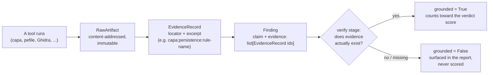
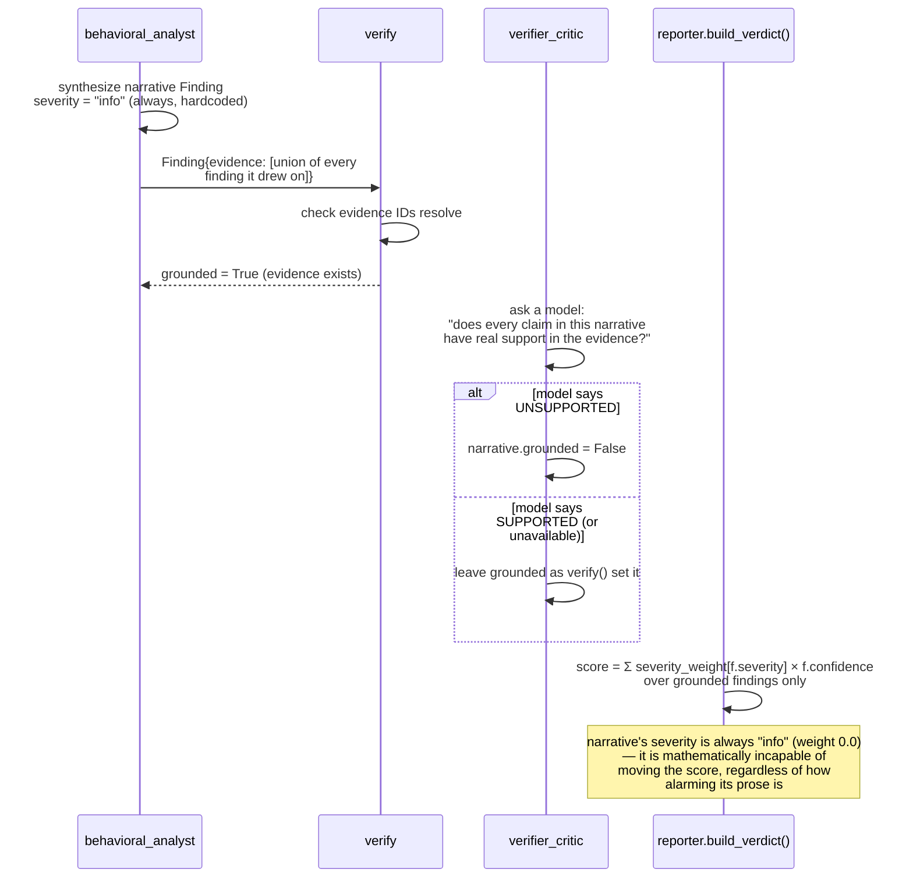
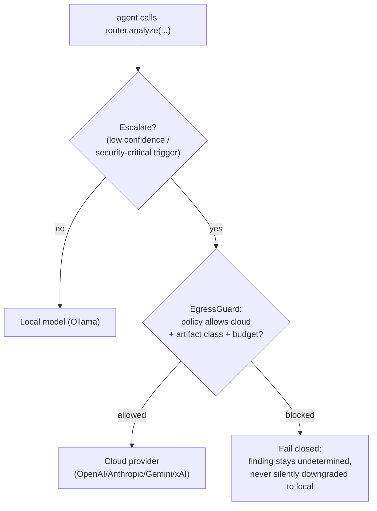

# MAL-AGENT Architecture

This is the map of how MAL-AGENT is put together and *why* — not just
what each file does. If you read one document before touching the code,
read this one.

## The one-paragraph version

MAL-AGENT takes a suspicious file, runs it through a pipeline of
deterministic tools (PE parsing, capa capability detection, Ghidra
decompilation, Authenticode checks) and optional LLM reasoning agents,
and produces a verdict — `malicious` / `suspicious` / `benign` /
`undetermined` — that a human can audit end-to-end. The one rule that
shapes every other design decision: **every claim the system makes must
trace back to tool evidence, and the verdict score is computed
deterministically from that evidence — never from an LLM's opinion.**
LLMs are used to *narrate* what the evidence means in readable prose, and
that narrative is itself fact-checked against the evidence before it's
trusted — but it can never move the needle on malicious-vs-benign. That
separation is the whole point.

---

## 1. Why this shape exists

Three problems motivate the architecture:

1. **LLMs hallucinate, and malware analysis can't tolerate that.** A model
   that says "this looks like ransomware" with no evidence is worse than
   useless — it's actively misleading. So findings that aren't backed by
   evidence get dropped, and the numeric verdict score never depends on
   an LLM's severity assessment.
2. **Analysts need to trust automation to actually adopt it.** Every
   finding lists the evidence it's based on; every report includes an
   unabridged appendix of raw evidence and a tamper-evident audit log.
   Nothing is a black box.
3. **Real environments are heterogeneous and policy-constrained.** Some
   deployments can call cloud LLMs (OpenAI/Anthropic/Gemini/xAI); some
   can't (air-gapped SOC, compliance-restricted). The system has to
   degrade honestly (report `undetermined`, not silently guess `benign`)
   rather than assume a specific environment.

## 2. High-level pipeline

```mermaid
flowchart LR
    Sample[/"Sample file"/] --> Ingest["ingest()\nSHA256 identity, defang,\nquarantine, provenance"]
    Ingest --> Triage
    subgraph Pipeline["orchestrator.run_linear() -- one stage at a time, budget-enforced"]
        direction TB
        Triage["triage\nKnownGood + StaticFeatures\n+ PEHeader + capa + Authenticode"]
        Static["static\nGhidra per-function decompile\n(capa-ranked functions)"]
        Dynamic["dynamic\n(stubbed -- reports itself\nhonestly as not run)"]
        TTP["ttp\nATT&CK technique aggregation"]
        Behavioral["behavioral_analyst\nLLM narrative synthesis\n(severity always = info)"]
        Verify["verify\ndeterministic grounding gate"]
        Critic["verifier_critic\nLLM fact-checks the narrative\nagainst the raw evidence"]
        Triage --> Static --> Dynamic --> TTP --> Behavioral --> Verify --> Critic
    end
    Critic --> Reporter["reporter.build_verdict()\ndeterministic, evidence-weighted"]
    Reporter --> Outputs["report.md · report.txt (unabridged)\n· verdict.json"]
```



Every stage is a pure(ish) function `(AnalysisState) -> AnalysisState` —
the state accumulates findings, evidence, and stage results as it flows
through. That purity means the orchestration substrate (today: a linear
runner; optionally LangGraph) is an implementation detail, not a
structural commitment.

A **known-good hash match** (an NSRL-style allowlist) short-circuits the
expensive stages (`static`, `dynamic`, `behavioral_analyst`,
`verifier_critic`) entirely — no reason to decompile or call an LLM on a
file that's already cryptographically known to be trusted software.

## 3. The evidence-grounding model (the differentiator)

This is the mechanism that keeps the system honest.



Concretely: a `Finding` (`contracts.py`) carries `evidence: list[str]` —
IDs into `state.evidence: list[EvidenceRecord]`. The deterministic
`verifier_agent` checks that every cited evidence ID actually resolves to
a real record before setting `grounded=True`. Only grounded findings
contribute to `reporter.build_verdict()`'s score. Everything else —
speculative LLM output, findings whose evidence didn't survive, whatever
— is still shown in the report (transparency), just clearly labeled and
excluded from the number that matters.

## 4. Why an LLM narrative can never decide the verdict

This is enforced twice: once by construction, once by a regression test
that would fail if either invariant regressed.



`tests/test_llm_agents_never_score.py` asserts this directly: it feeds
`behavioral_analyst` a deliberately alarming, all-caps "this is definitely
ransomware!!!" fake model response over evidence that would otherwise
land on `benign`/`undetermined`, and asserts the verdict doesn't move.
That test is the guardrail — if someone later "improves" the narrative
agent by giving it a severity dial, this test catches it.

## 5. Tool inventory

| Tool | Stage | What it contributes | Notes |
|---|---|---|---|
| `KnownGoodTool` | triage | Hash-allowlist match → short-circuits to `benign` | NSRL RDS-style CSV/hash-per-line |
| `StaticFeaturesTool` | triage | Entropy, ASCII + wide/UTF-16LE strings, IOC extraction (IPs/URLs/mutexes) | Suspicious-string heuristics |
| `PEHeaderTool` | triage | Imports, imphash, per-section entropy, overlay detection, Rich header checksum | `pefile`, `fast_load` mode |
| `AuthenticodeTool` | triage | Signer identity (informational — *not* a trust short-circuit) | Windows-only, `Get-AuthenticodeSignature` via env-var-passed subprocess |
| `CapaTool` | triage | Capability + ATT&CK + MBC (Malware Behavior Catalog) detection | Real capa-rules corpus; namespace-aware severity (see §6) |
| `GhidraTool` | static | Per-function decompilation of capa-ranked functions | `pyghidra` in-process (not subprocess+Jython — Ghidra ≥11 doesn't bundle Jython) |
| dynamic sandbox | dynamic | — | Contract-present, intentionally stubbed (v1 is static-only); reports itself as `skipped`, never silently `benign` |

Full technique-coverage matrix (what's implemented, what isn't, and
why) lives in `docs/AUDIT.md`.

## 6. Verdict scoring — deterministic, evidence-weighted

`reporter.build_verdict()` (no LLM involved):

1. Known-good hash match → `benign`, high confidence, done.
2. Otherwise, sum `severity_weight[finding.severity] × finding.confidence`
   over grounded findings (`info=0.0, low=1.0, medium=2.5, high=4.0,
   critical=6.0`).
3. **Corroboration gate:** `capa` findings only count as `medium`+ if
   their rule's namespace is inherently attacker-relevant on its own
   (`anti-analysis`, `collection`, `communication`, `exploitation`,
   `impact`, `load-code`, `persistence`, `malware-family`). A verdict of
   `suspicious`/`malicious` additionally requires matches spanning **≥3
   distinct** such namespace categories — a handful of matches in just
   one or two categories (individually false-positive-prone: e.g.
   anti-debugging checks are also common in legitimate DRM/licensing
   code) isn't enough to convict alone.
4. No corroboration but some attacker-relevant signal → `undetermined`
   (honest "can't tell", not a guess).
5. Grounded findings exist and the deep stages actually ran, but no
   attacker-relevant signal → `benign`.
6. Otherwise → `undetermined` (insufficient evidence/coverage to assert
   anything).

This gate exists because of a real false positive found during live
testing: a stock `notepad.exe` scored `MALICIOUS 0.9` before the gate
existed, because every capa match — including entirely mundane ones like
"read file" or "get disk size" — carried equal `medium` severity. Fixed,
verified live, documented in `docs/AUDIT.md` and the README's "Verified
live" section. **This is a heuristic improvement grounded in real data,
not validated calibration** — that needs labeled malware/benign datasets
(tracked as M6 in `docs/TODO.md`).

## 7. Model routing & egress policy

`ModelRouter` (`models.py`) is local-first with policy-gated escalation:



Raw sample bytes never leave the local environment under any policy.
Decompiled pseudocode may egress to cloud only if the client's
`EgressPolicy` explicitly allows it. Every model call — provider,
local/cloud, prompt hash, whether egress was permitted — is recorded on
`AnalysisState.model_calls` and appears in the report's audit appendix.

## 8. Audit trail

`AuditLog` (`audit.py`) is an append-only, hash-chained log: each record
commits to the previous record's hash, so `audit.verify()` can detect any
retroactive edit. This is the chain-of-custody backbone for samples
received from a SOC/CDC — every stage transition, every model call, every
egress decision is logged with a timestamp and gets re-verified on demand.

## 9. What a run produces

Every `analyze()` call — CLI or library — writes three artifacts,
unconditionally (never gated behind a flag):

| File | Purpose | Notable property |
|---|---|---|
| `<hash>_report.md` | Human-readable summary | Caps findings at 25, no raw evidence text |
| `<hash>_report.txt` | **Mandatory** detailed report | Unabridged: every grounded/ungrounded finding, every evidence excerpt, the full audit log, all model calls, across 8 appendices (A–H). Three-tier narrative fallback: verified `behavioral_analyst` prose → fresh LLM call over grounded findings → fully templated text derived from the verdict record if no model is available at all. Never has a missing section. |
| `<hash>_verdict.json` | Machine-readable verdict | `Verdict` contract, ready for SIEM/ticketing ingestion |

Filenames are namespaced by the sample's SHA256 prefix, so multiple
samples analyzed into the same output directory never silently overwrite
each other.

## 10. CLI surface

```
mal-agent <path> [--source soc|cdc|manual|dataset] [--ticket ID]
                 [--enable-models] [--no-cloud] [--escalation-provider ...]
                 [--out ./mal-agent-reports]

mal-agent doctor
```

`mal-agent doctor` runs eight independent checks (pefile, capa+rules+sigs,
Ghidra+pyghidra, Java, Ollama+model, cloud API keys, database, known-good
allowlist) and reports `PASS`/`WARN`/`FAIL` per check — `FAIL` means
something was explicitly configured but is broken, not merely absent.
Exit code is non-zero iff any check is `FAIL`.

## 11. Data contracts (the stable core)

Everything in `contracts.py` is a frozen Pydantic v2 model — this is the
one part of the system that's deliberately expensive to change, because
every tool, agent, and storage backend is written against it. Swapping
Ollama for vLLM, or the in-memory repository for Postgres, or the linear
runner for LangGraph, never touches these:

`Sample`, `RawArtifact`, `EvidenceRecord`, `Finding`, `IOC`,
`StageResult`, `EgressPolicy`, `StepBudget`, `ModelCall`, `AnalysisState`,
`Verdict`, `AuditRecord`.

## 12. Repository layout

```
malagent/          the package: tools.py, agents.py, orchestrator.py,
                    pipeline.py, reporter.py, contracts.py, models.py,
                    doctor.py, cli.py, ghidra_tool.py, knowngood.py, ...
tests/              one test file per module/behavior, TDD throughout
scripts/            install.ps1/.sh (Python-only), install-full.ps1/.sh
                    (also installs Ghidra/JDK/Ollama/Postgres)
config/             default.yaml
docs/               ARCHITECTURE.md (this file), SETUP.md, AUDIT.md,
                    TODO.md, V2-DESIGN.md, the research paper, plans/
docker-compose.yml  optional Postgres (port 5433, not 5432 -- see file)
pyproject.toml      package metadata + extras (full, providers, ghidra, dev)
```

## Where to go next

- **Setting it up:** `docs/SETUP.md`
- **What's implemented vs. not, and why:** `docs/AUDIT.md`
- **Task-by-task roadmap:** `docs/TODO.md`
- **The bigger design rationale (LLM agent layer, tool sequencing,
  packaging):** `docs/V2-DESIGN.md`
- **The research framing this grew out of:**
  `docs/AI-Malware-Analysis-Research-and-Framework.md`
