# The pipeline, tool by tool

What runs, in what order, and why each piece exists. Simple technical
explanations — for the deeper "why this architecture" reasoning see
`docs/ARCHITECTURE.md`.

## The full pipeline

```mermaid
flowchart TD
    Sample[/"sample file"/] --> Ingest["ingest\nSHA256/MD5 hash, magic-byte\nfile-type detection, defang + quarantine"]
    Ingest --> KG

    subgraph TRIAGE["TRIAGE — deterministic, always runs"]
        direction TB
        KG["KnownGoodTool\nhash vs. trusted allowlist"]
        KG -->|no match| SF["StaticFeaturesTool\nentropy, strings, IOC regex"]
        SF --> IOC["IocReputationTool\nIP/domain blocklist check"]
        IOC --> UNPACK["UnpackerTool\nrecursive ZIP/ISO 9660 unpacking"]
        UNPACK --> PE["PEHeaderTool\nimports, imphash, entropy,\noverlay, Rich header, .rsrc"]
        PE --> ELF["ElfTool\nELF imports + section entropy"]
        ELF --> MACHO["MachoTool\nMach-O header ID only"]
        MACHO --> CAPA["CapaTool\ncapability + ATT&CK + MBC mapping"]
        CAPA --> AUTH["AuthenticodeTool\nsigner identity (Windows)"]
        AUTH --> YARA["YaraMatchTool\nmatch operator's YARA rules"]
        YARA --> DIE["DieTool\npacker/compiler ID"]
        DIE --> VT["VirusTotalTool\nhash reputation lookup"]
    end

    KG -.->|hash MATCH| SHORT["short-circuit:\nskip static/dynamic/behavioral_analyst/verifier_critic\nverdict = benign immediately"]
    SHORT -.-> Reporter

    VT --> STATIC

    subgraph STATIC["STATIC — deterministic tools, then optional LLM"]
        direction TB
        GHIDRA["GhidraTool\ndecompile capa-ranked functions\n+ caller/callee call graph"]
        GHIDRA --> FLOSS["FlossTool\nrecover deobfuscated/stacked strings"]
        FLOSS --> LLMSTATIC["LLM per-function summaries\n(gated: --enable-models)"]
    end

    STATIC --> DYNAMIC["DYNAMIC\nintentional v1 stub — sandbox\ndetonation is future work"]
    DYNAMIC --> TTP["TTP\nATT&CK technique ID -> real name\n(692-entry MITRE reference table)"]
    TTP --> BA["BEHAVIORAL_ANALYST\nLLM narrative, grounded via real\nretrieved MITRE tactic descriptions"]
    BA --> VERIFY["VERIFY\ngrounding gate: no evidence -> dropped;\nscans evidence text for prompt injection"]
    VERIFY --> VC["VERIFIER_CRITIC\nLLM fact-checks the narrative\nagainst its cited evidence"]
    VC --> Reporter["reporter.build_verdict()\n100% DETERMINISTIC scoring —\nno LLM output ever reaches this"]
    Reporter --> Verdict(["Verdict:\nmalicious / suspicious /\nbenign / undetermined"])
```

**The one rule that shapes everything below**: only `reporter.build_verdict()`
computes the actual score. Every LLM-touched stage (`static`'s per-function
summaries, `behavioral_analyst`, `verifier_critic`) is hard-coded to
`severity="info"`, which carries zero weight in the scoring formula — so
no LLM opinion, however confident-sounding, can ever move the verdict.
This is enforced by a dedicated test
(`tests/test_llm_agents_never_score.py`), not just a design intention.

---

## Triage stage — cheap, deterministic, always runs first

| Tool | What it does | Why it's here | What it adds |
|---|---|---|---|
| **KnownGoodTool** | Checks the file's SHA256 against a trusted-hash allowlist (e.g. an NSRL import). | Most submitted files are ordinary, unmodified system software — no point running an expensive pipeline on a file we already have cryptographic proof is trusted. | Live-measured: **0.88s** vs. several minutes for the full pipeline on a match. |
| **StaticFeaturesTool** | Shannon entropy of the whole file, ASCII + wide/UTF-16LE string extraction, regex-based IOC extraction (IPs, URLs, domains, emails). | The cheapest possible signal — no external tool, no parsing library needed. Packed files look high-entropy; strings often leak C2 domains or file paths directly. | Near-instant first pass; catches obvious IOCs and packing before anything expensive runs. |
| **IocReputationTool** | Cross-references the IPs/domains/URLs just extracted against local threat-intel blocklists. | A domain string alone means nothing — but if it's on a real, maintained bad-infrastructure list, that's a specific, corroborating signal, not just a guess. | Turns "found a domain" into "found a *known-bad* domain," with zero network egress. |
| **UnpackerTool** | Recursively unpacks ZIP and ISO 9660 containers (depth/size-bounded against zip-bombs), flags risky imports in any extracted PE, and flags suspicious multi-layer nesting (e.g. a ZIP wrapping an ISO wrapping an executable). | Real malware in this project's own dataset arrives as a ZIP wrapping an ISO wrapping a PE — a documented technique, since ISO mounting historically bypassed the Windows Mark-of-the-Web flag that ZIP extraction sets. Nothing else in the pipeline looks past the outer container's raw bytes. | Recovers samples that previously never reached any classifier at all — found and fixed a real false positive along the way: Office documents (.xlsx/.docx/.pptx) are themselves ZIP archives and must not be treated as suspicious nesting. |
| **PEHeaderTool** | Parses PE structure via `pefile`: risky imports (e.g. `CreateRemoteThread`), imphash, per-section entropy, overlay (data appended past the last section), Rich header, and `.rsrc` resource walking (finds embedded PE files or high-entropy blobs hidden in icons/resources). | Whole-file entropy can hide a small packed region inside an otherwise-normal file; per-section and per-resource checks catch what whole-file averaging misses. | Specific, located evidence — not "suspicious," but "this exact import, this exact section." |
| **ElfTool** | Linux/ELF equivalent: dynamic-symbol imports (`ptrace`, `execve`, `mprotect`, `memfd_create`, ...) and non-standard-section entropy. | Without it the pipeline was PE-only and blind to Linux server malware / IoT botnets. | Parity of coverage across the two dominant executable formats. |
| **MachoTool** | Identifies Mach-O header fields (CPU type, file type) only — no deeper heuristics. | Deliberately minimal: no real macOS sample existed in this dev environment to verify a stronger check against, and guessing at unverified heuristics isn't this project's style. | Honest, narrow coverage instead of fabricated depth. |
| **CapaTool** | Runs Mandiant's `capa` — matches the binary against thousands of community capability-detection rules, each mapped to an ATT&CK technique and/or MBC (Malware Behavior Catalog) behavior. | The richest deterministic signal in the pipeline: not just "suspicious," but *what it can do* (inject into a process, encrypt data, query the registry...), each tied to a real matching rule. | This is the backbone the scoring gate, the ATT&CK narrative, and the retrieval-grounded synthesis are all built on top of. |
| **AuthenticodeTool** | Checks Windows code-signing: is the file signed, and by whom. | Legit software is usually signed — but stolen/abused signing certs are a real, documented attack vector (Stuxnet, SolarWinds), so a signature must never grant immunity. | Corroborating context only: a valid signature raises the conviction bar by one category, it doesn't remove it. |
| **YaraMatchTool** | Matches the sample against an operator-supplied YARA rule set (community or in-house). Distinct from this project's own rule *generation*, which always runs. | YARA matching is the industry-standard way to share "here's a signature for a known threat." | Near-instant "is this a previously-catalogued threat" check. |
| **DieTool** | Runs Detect It Easy (`diec`) — a dedicated packer/compiler/protector identification database. | Knowing a file is packed with a *specific, named* packer is a stronger, more specific signal than generic high-entropy heuristics. | Identifies *which* packer, sometimes revealing attacker tooling preferences. |
| **VirusTotalTool** | Looks up the file's hash against VirusTotal's aggregated multi-engine reputation database. | If dozens of AV engines already flag this exact file, that's an extremely strong corroborating signal — and it only needs a hash, not the raw file. | Leverages the whole industry's detection; requires its own explicit network-egress opt-in since even a hash lookup is still egress. |

## Static stage — deeper, more expensive, still deterministic-first

| Tool | What it does | Why it's here | What it adds |
|---|---|---|---|
| **GhidraTool** | Headless-decompiles the top-N functions capa flagged as most interesting into real pseudocode, and traces caller/callee edges between them (a call graph). | Capa tells you *that* a capability exists structurally; decompilation lets you actually read the logic behind it. | The deepest, most detailed evidence in the pipeline — real code context, not just a rule match. |
| **FlossTool** | Recovers strings *constructed or decoded at runtime* (stack strings, XOR/base64-decoded-in-a-loop strings) that plain byte-pattern scanning can't see. | Malware authors hide meaningful strings (C2 URLs, mutex names) precisely *because* plain extraction would reveal them. | Recovers IOCs/capabilities otherwise invisible; runs unconditionally, not gated behind an LLM. |
| **LLM per-function summaries** | An LLM reads each decompiled function and writes a plain-language summary, flagging anything suspicious. Only runs with `--enable-models`. | Reading dozens of decompiled functions by hand is slow; an LLM can triage which ones deserve a closer human look. | Narrative only — `severity="info"` always, so it can never move the verdict score. |

## Everything after static

| Stage | What it does | Why it's here | What it adds |
|---|---|---|---|
| **dynamic** | Intentionally reports itself `skipped` — no sandbox detonation in v1. | Static-only was the explicit v1 scope decision; sandbox integration is documented future work, not an oversight. | Honesty: it never silently pretends to have run. |
| **ttp** | Groups every capability finding by ATT&CK technique ID and resolves each to its real name via a local 692-entry reference table (sourced from MITRE's own corpus). | Technique IDs like `T1055` mean nothing to most readers without translation to "Process Injection." | Makes the report legible without a MITRE reference open in another tab; unresolved IDs are flagged honestly, never guessed. |
| **behavioral_analyst** | Synthesizes every grounded finding so far into one narrative, now grounded in real retrieved MITRE tactic descriptions for whichever tactics this sample's techniques actually belong to (e.g. "Defense Evasion: the adversary is trying to avoid being detected") — a real kill-chain shape, not just a flat capability list. | A list of 30+ separate findings is hard for a human to mentally assemble into "so what does this thing actually do." | `severity="info"` always — narrative only, never the score, enforced by a dedicated regression test. |
| **verify** | The grounding gate: findings need ≥1 real evidence citation to survive; also scans evidence text for prompt-injection patterns (attacker-controlled strings trying to hijack an LLM reading them). | An LLM or heuristic can *claim* anything — this is what makes "evidence-grounded" true rather than a slogan. | The core trust mechanism of the whole system. |
| **verifier_critic** | An independent LLM re-reads the narrative *and* its cited evidence, and can downgrade it if it finds overclaiming. | `verify` only checks "is there *some* evidence attached" (no understanding of content) — this adds real semantic fact-checking. | Catches LLM hallucination/overclaiming specifically, independent of whoever wrote the narrative. |
| **reporter.build_verdict()** | The *only* place the final verdict and confidence are computed — 100% deterministic arithmetic: known-good short-circuit, severity-weighted score sum, ≥3-distinct-category corroboration gate, and a coverage check (did enough real deterministic analysis actually happen) before confidently calling something `benign`. | This is the single most load-bearing design decision in the project: no LLM's opinion can ever move this number. | A fully auditable, reproducible verdict — resistant to hallucination or prompt injection influencing the actual decision. |
